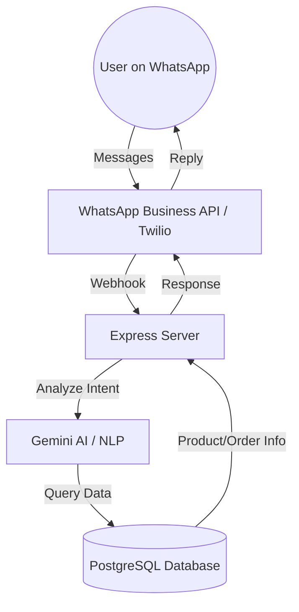

# WhatsApp Shopping Bot Architecture

This document outlines the architecture and implementation plan for the WhatsApp Shopping Bot integrated with the Priority Bags e-commerce platform.

## 1. System Overview
The WhatsApp bot acts as an interactive shopping assistant, allowing users to browse products, check order status, and receive personalized recommendations directly via WhatsApp.

## 2. Key Features
- **Product Discovery**: Users can search for products by name or category.
- **Order Tracking**: Check the status of current orders using email or order ID.
- **Shopping Assistant**: AI-powered recommendations based on user preferences.
- **Human Handoff**: Option to connect with a support agent.

## 3. Tech Stack
- **Messaging**: Twilio WhatsApp API (for development) or Meta WhatsApp Business API.
- **AI Intelligence**: Google Gemini Pro (via API).
- **Backend**: Node.js/Express (Integrated into existing `server.js`).
- **Database**: Supabase / PostgreSQL.
- **Frontend Management**: React JS with Stitch for the Admin Bot Dashboard.

## 4. Implementation Steps
1. **Webhook Setup**: Create `/api/v1/whatsapp/webhook` to receive incoming messages.
2. **Intent Parsing**: Implementation of a message handler that uses regex or AI to understand user requests.
3. **Database Integration**: Connect the handler to `catalog` and `orders` modules.
4. **Interactive Messages**: Implementation of WhatsApp list messages and buttons for easier navigation.
5. **Dashboard**: A React-based interface to monitor bot conversations and performance.

## 5. File Structure Modifications
- `server.js`: Registering the WhatsApp route.
- `server-src/modules/whatsapp/`: New module for bot logic.
  - `whatsapp.routes.js`: Route definitions.
  - `whatsapp.controller.js`: Handling incoming messages.
  - `whatsapp.service.js`: Business logic and AI interaction.
- `src/pages/BotDashboard.jsx`: React component for bot management.
